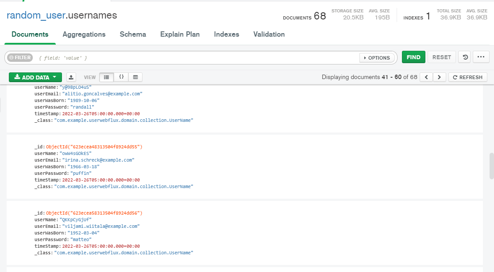

# Aplicación FullStack (_Random User_)

_Aplicación fullStack (Spring boot, webflux, MongoDB, react)._

## Ejecución del proyecto ⌨️
_`Mongo db: localhost:27017`_
_`Spring boot: localhost:8080`_
_`React: localhost:3000`_

### Dependecias necesarias para la ejecución del proyecto  📦  

    <dependencies>
        <dependency>
            <groupId>org.springframework.boot</groupId>
            <artifactId>spring-boot-starter-data-mongodb-reactive</artifactId>
        </dependency>
        <dependency>
            <groupId>org.springframework.boot</groupId>
            <artifactId>spring-boot-starter-validation</artifactId>
        </dependency>
        <dependency>
            <groupId>org.springframework.boot</groupId>
            <artifactId>spring-boot-starter-webflux</artifactId>
        </dependency>

        <dependency>
            <groupId>org.springframework.boot</groupId>
            <artifactId>spring-boot-devtools</artifactId>
            <scope>runtime</scope>
            <optional>true</optional>
        </dependency>
        <dependency>
            <groupId>org.projectlombok</groupId>
            <artifactId>lombok</artifactId>
            <optional>true</optional>
        </dependency>
        <dependency>
            <groupId>org.springframework.boot</groupId>
            <artifactId>spring-boot-starter-test</artifactId>
            <scope>test</scope>
        </dependency>
        <dependency>
            <groupId>io.projectreactor</groupId>
            <artifactId>reactor-test</artifactId>
            <scope>test</scope>
        </dependency>
    </dependencies>

### Organización de carpetas
`infrastructure`
* **command_routers**
* **query_routers**

`aplication`
* **interface**
* **mappers**
* **useCase**
* **utils**

`config`
* **webfluxConfig**

`domain`
* **collection**
* **dto**
* **repository**

### Endpoints 📌 

_Resource command controllers_
`POST`
* [CreateUserNameRouter](http://www) - crear usuario aleatorio

_Resource query controllers_
`GET`
* [findAllUserNamesRouter](http://www) - mostrar todos los usuarios
* [findUserNameByIdRouter](https://) - filtrar por id

## Funcionamiento
### pruebas insomnia

## Autora ✒️
* **Lina Maria Guerrero** - *Random user* - [LMFront-end](https://github.com/LMFront-end)

### Sofka-U 2022 📄 
